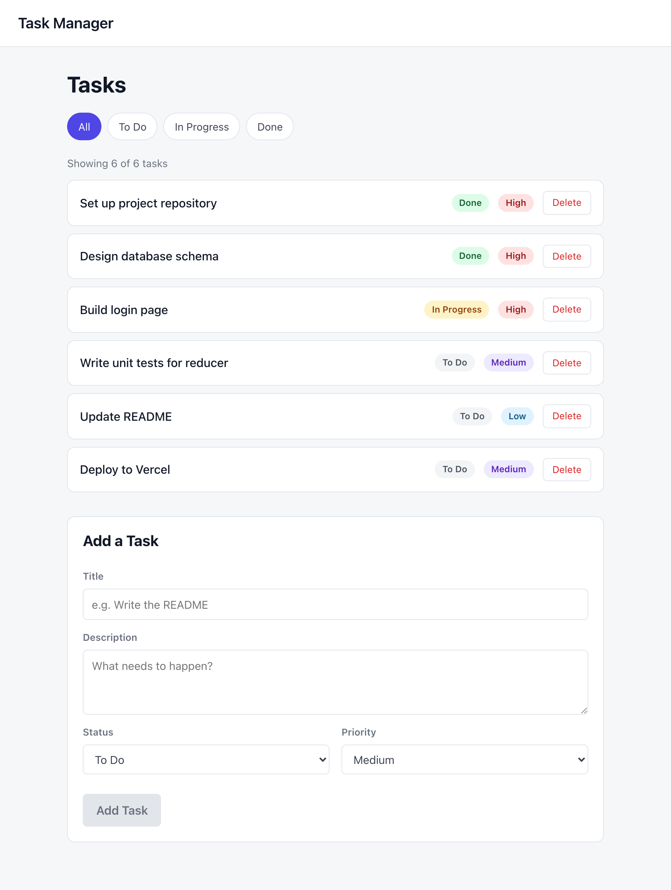
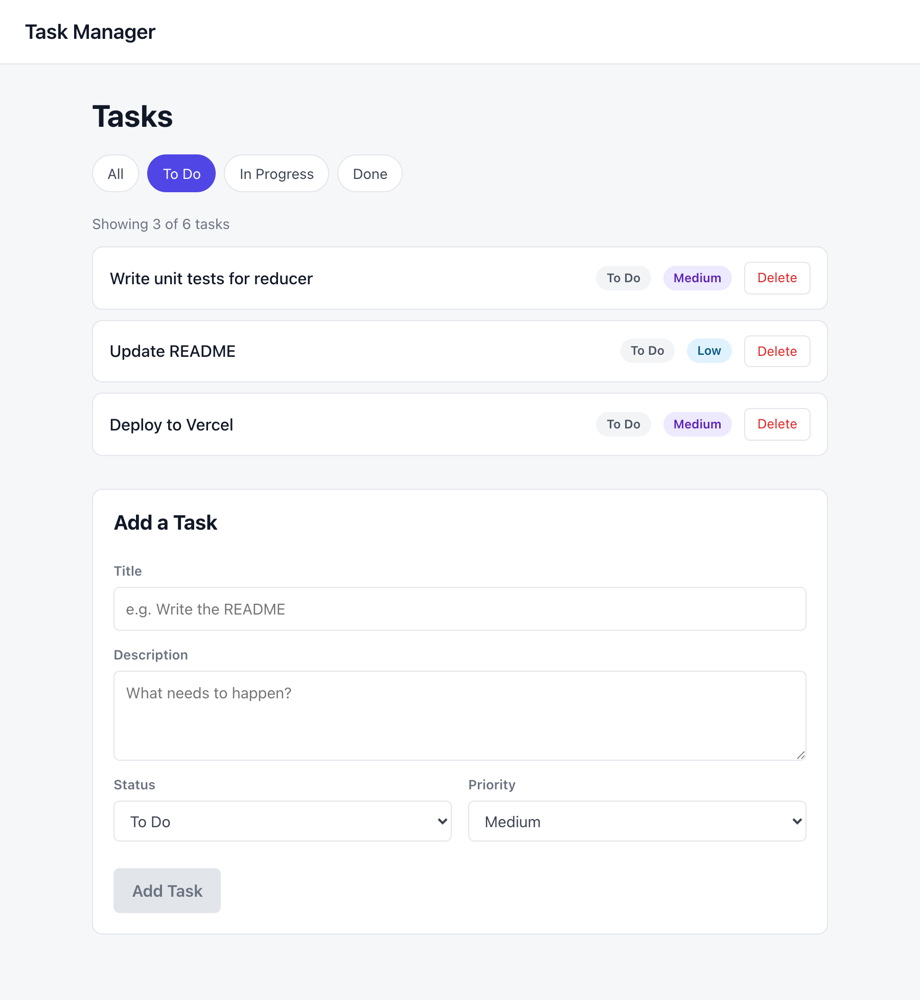
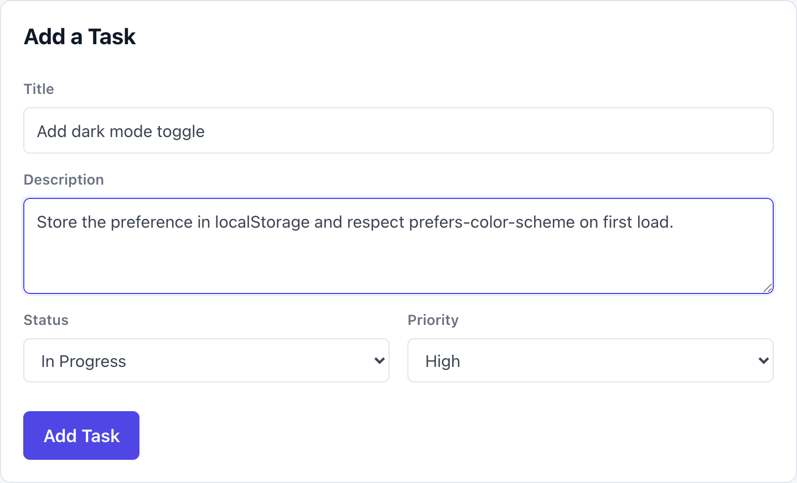
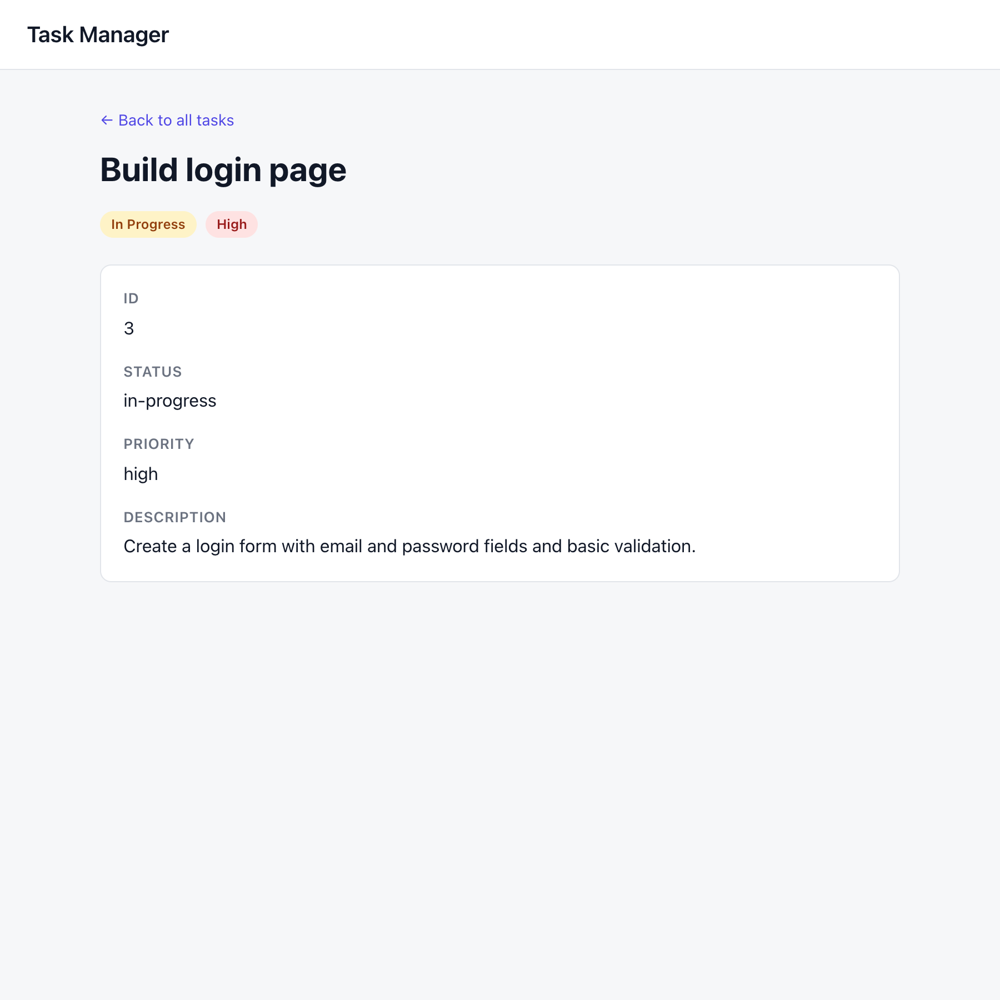

# Task Manager

Module 2 assignment — a small React app for viewing, adding, deleting, and filtering tasks.
All state lives in a `useReducer` store shared through `useContext`, and the two pages are
wired up with React Router.

## Install and Run

```bash
# 1. Install dependencies
npm install

# 2. Start the dev server
npm run dev
```

Vite prints a local URL (usually <http://localhost:5173>). Open it and you'll be redirected
from `/` to `/tasks`.

Other scripts:

```bash
npm run build     # production build into dist/
npm run preview   # serve the production build locally
npm run lint      # ESLint
```

## Screenshots

### Task list — filter bar, count summary, status/priority badges, delete buttons

The count line under the filter bar and the greyed-out **Add Task** button are the two Easy
bonus challenges.



### Filtered by "To Do" — the count updates to "Showing 3 of 6 tasks"



### Add Task form with valid input — the submit button becomes active



### Task detail page at `/tasks/:id`



## How It Works

### Reducer — `src/reducer/taskReducer.js`

The reducer is a pure function: it never mutates `state`, it returns a new object each time.

| Action type | Payload | Effect |
| --- | --- | --- |
| `ADD_TASK` | task object | Appends to `tasks` |
| `DELETE_TASK` | task id | Removes that task from `tasks` |
| `SET_FILTER` | `'all' \| 'todo' \| 'in-progress' \| 'done'` | Updates `filter` |

Initial state seeds six tasks with a mix of statuses and priorities, and `filter: 'all'`.

### Context — `src/context/TaskContext.jsx`

`TaskProvider` holds the `useReducer` call and exposes `tasks`, `filteredTasks`, `filter`,
`addTask`, `deleteTask`, and `setFilter`. The `useTasks()` hook wraps `useContext` and throws
a clear error if a component tries to read the context outside the provider.

`filteredTasks` is **derived during render**, not stored in state:

```js
const filteredTasks =
  filter === 'all' ? tasks : tasks.filter((task) => task.status === filter);
```

Keeping it out of state means it can never drift out of sync with `tasks` or `filter`.

### Routes — `src/App.jsx`

| Path | Component | Notes |
| --- | --- | --- |
| `/` | — | Redirects to `/tasks` via `<Navigate replace />` |
| `/tasks` | `TaskListPage` | Filter bar, count summary, task list, add form |
| `/tasks/:id` | `TaskDetailPage` | All fields for one task, or "Task not found" |

`<Header />` sits outside `<Routes>`, so it renders on every page.

### Components

- **`Header`** — the app name, linking back to the task list.
- **`FilterBar`** — four buttons that call `setFilter`; the active one gets an `active` class.
- **`TaskList`** — maps over `filteredTasks`; each row links to `/tasks/:id`, shows a status
  badge and priority badge, and has a Delete button wired to `deleteTask`.
- **`AddTaskForm`** — a controlled form (one state object, one shared `handleChange` keyed by
  each input's `name`). On submit it calls `addTask` and resets to the empty form.
- **`TaskDetailPage`** — reads `:id` with `useParams`, converts it to a number, and finds the
  matching task. Renders a "Task not found" message when nothing matches.

### Project Structure

```
src/
├── App.jsx                     # provider + router + routes
├── App.css                     # component styles
├── main.jsx                    # React entry point
├── components/
│   ├── AddTaskForm.jsx
│   ├── FilterBar.jsx
│   ├── Header.jsx
│   └── TaskList.jsx
├── context/
│   └── TaskContext.jsx         # TaskProvider + useTasks hook
├── pages/
│   ├── TaskDetailPage.jsx
│   └── TaskListPage.jsx
└── reducer/
    └── taskReducer.js          # seed data + reducer
```

## Bonus Challenges Completed

### Easy — both done

**1. Task count summary above the list.** `TaskListPage` pulls both `filteredTasks` and
`tasks` from context and renders `Showing X of Y tasks`. Because `filteredTasks` is derived
during render, the numbers update on their own when you switch filters, add a task, or delete
one — no extra state and no `useEffect`.

**2. Submit button disabled while a required field is empty.** `AddTaskForm` computes an
`isFormValid` flag during render from the two fields the user has to type (title and
description — status and priority always hold a valid default):

```js
const isFormValid = form.title.trim() !== '' && form.description.trim() !== '';
```

It drives `disabled={!isFormValid}` on the button, and the same flag guards `handleSubmit`
so a keyboard submit can't bypass the disabled button. `trim()` means whitespace alone doesn't
count as filled. Disabled state is styled with a `.submit-button:disabled` rule.

### Medium and Hard — not attempted

localStorage persistence, `UPDATE_TASK` with inline editing, drag-and-drop reordering, and the
combined priority filter were not implemented.

## AI and Tools

- **Claude (Claude Code)** — used to scaffold the initial components, reducer, and context, to
  implement the two Easy bonus challenges. I reviewed every change and can explain each line.

No code was copied from external sources. The patterns follow the official React docs:

- [Extracting State Logic into a Reducer](https://react.dev/learn/extracting-state-logic-into-a-reducer)
- [Passing Data Deeply with Context](https://react.dev/learn/passing-data-deeply-with-context)
- [Scaling Up with Reducer and Context](https://react.dev/learn/scaling-up-with-reducer-and-context)
- [React Router docs](https://reactrouter.com/)
